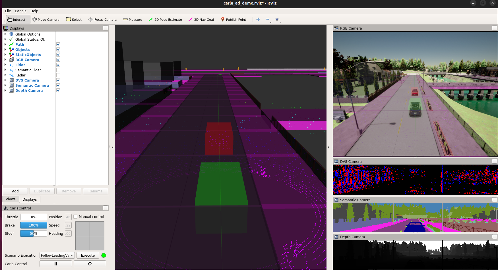

# carla_ros_bridge_docker

## Introduction

This is a Dockerfile to use [CARLA ROS bridge](https://github.com/carla-simulator/ros-bridge) on Docker container.



Current [carla-simulator/ros-bridge](https://github.com/carla-simulator/ros-bridge) supports to CARLA 0.9.11. So, I used CARLA 0.9.11 in this Dockerfile. And, base image of this Docker file is `nvidia/cudagl:11.4.2-devel-ubuntu18.04`.
Because, there is the folliwng description in official document(<https://carla.readthedocs.io/en/0.9.13/start_quickstart/>).

> The Debain package is available for both Ubuntu 18.04 and Ubuntu 20.04, however the officially supported platform is Ubuntu 18.04.

## Requirements

* NVIDIA graphics driver
* Docker
* nvidia-docker2

## Preparation

### Build Docker image

```shell
docker build -t carla:0.9.11 --build-arg GID=$(id -g) --build-arg UID=$(id -u) -f Dockerfile.melodic .
```

### Create Docker container

```shell
./launch_container.sh
```

## Usage

### CARLA ROS bridge

#### 1. Launch CARLA Simulator

Please launch CARLA Simulator by the following command.

```shell
/opt/carla-simulator/CarlaUE4.sh -windowed -ResX=160 -ResY=120
```

#### 2. Set the configuration of CARLA Simulator

```shell
cd /opt/carla-simulator/PythonAPI
python util/config.py -m Town03 --fps 10
```

#### 3. Launch CARLA ROS bridge

```shell
roslaunch carla_ros_bridge carla_ros_bridge_with_example_ego_vehicle.launch vehicle_filter:='vehicle.toyota.prius*'
```

### CARLA AD Demo

#### 1. Launch CARLA Simulator

Please launch CARLA Simulator by the following command.

```shell
/opt/carla-simulator/CarlaUE4.sh -windowed -ResX=160 -ResY=120
```

#### 2. Set the configuration of CARLA Simulator

```shell
cd /opt/carla-simulator/PythonAPI
python util/config.py -m Town01 --fps 10
```

#### 3. Launch CARLA AD Demo

```shell
roslaunch carla_ad_demo carla_ad_demo_with_scenario.launch vehicle_filter:='vehicle.toyota.prius*'
```

And, please push `Execute` button from RViz panel.
